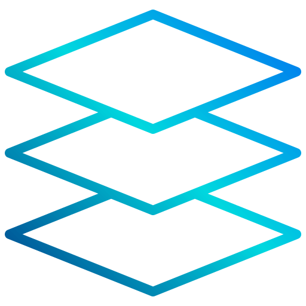
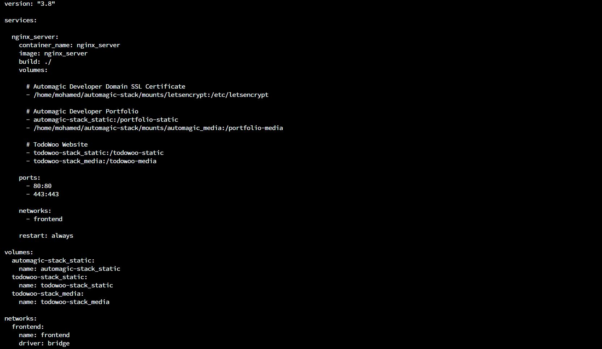

<!-- PROJECT SHIELDS -->
<!--
*** I'm using markdown "reference style" links for readability.
*** Reference links are enclosed in brackets [ ] instead of parentheses ( ).
*** See the bottom of this document for the declaration of the reference variables
*** for contributors-url, forks-url, etc. This is an optional, concise syntax you may use.
*** https://www.markdownguide.org/basic-syntax/#reference-style-links
-->

[![LinkedIn][linkedin-shield]][linkedin-url]

<!-- PROJECT LOGO -->
 

    

  <h3 align="center">Nginx Server in Docker Compose</h3>

<!-- TABLE OF CONTENTS -->

  
Table of Contents

  <ol>
    <li><a href="#about-the-project">About The Project</a></li>
    <li><a href="#contact">Contact</a></li>
  </ol>

<!-- ABOUT THE PROJECT -->
## About The Project

* Project Name: Nginx Server in Docker Compose
* Version: v1.0.0
* Organization Department: Technology

### Description

This project aims to create an efficient and secure infrastructure for 
hosting two Django web application stacks using Nginx and Docker Compose. 
The Nginx server acts as a reverse proxy, seamlessly serving both Django 
applications simultaneously.

#### Features

**Nginx Server in Docker Compose:** 

The project leverages Docker Compose to orchestrate the deployment of the 
Nginx server and the two Django web application stacks. This simplifies 
the setup process and ensures consistency across environments.

**Dual Django Web Application Stacks:** 

The Nginx server is configured to handle two separate Django web application 
stacks, each encapsulated within its Docker Compose configuration. This 
enables independent development and deployment for both applications.

**Automated SSL Certificate Acquisition:** 

To enhance security and enable HTTPS, the Nginx server automatically requests 
and acquires free SSL certificates for each Django application stack from 
Let's Encrypt. This ensures encrypted communication and a safer 
browsing experience.

**Frontend Network Integration:** 

The Nginx server container seamlessly joins the frontend network of each 
Django application stack. This integration allows efficient communication 
between the Nginx server and the services of the Django applications, 
enabling smooth data flow.

(<a href="#readme-top">back to top</a>)

### Built With

This project was developed using the following tech stacks:

* Nginx
* Docker
* Docker Compose

(<a href="#readme-top">back to top</a>)

<!-- CONTACT -->
## Contact

Mohamed AbdelGawad Ibrahim - [@m-abdelgawad](https://www.linkedin.com/in/m-abdelgawad/) - <a href="tel:+201069052620">+201069052620</a> - muhammadabdelgawwad@gmail.com

GitHub Profile Link: [https://github.com/m-abdelgawad](https://github.com/m-abdelgawad)

(<a href="#readme-top">back to top</a>)

<!-- MARKDOWN LINKS & IMAGES -->
<!-- https://www.markdownguide.org/basic-syntax/#reference-style-links -->
[linkedin-shield]: https://img.shields.io/badge/-LinkedIn-black.svg?style=for-the-badge&logo=linkedin&colorB=555
[linkedin-url]: https://www.linkedin.com/in/m-abdelgawad/
